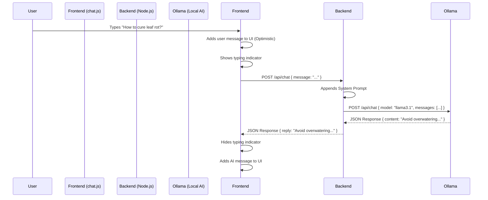

# Plant Scope AI - Chatbot Architecture Guide

## 1. Request / Response Flow

The chatbot follows a **Client-Server-Model** architecture to keep the frontend lightweight and the API keys/logic secure (even though Ollama is local here, this pattern prepares you for production).

### Flow Diagram


### Endpoints
- **Frontend**: Calls `http://localhost:3000/api/chat`
- **Backend**: Listens on port `3000`, forwards to `http://localhost:11434/api/chat`

---

## 2. Extending to Streaming Responses

Currently, the chatbot waits for the *entire* response from Ollama before sending it to the frontend. This can feel slow for long answers.
To fix this, you can enable **Server-Sent Events (SSE)** or **Streaming**.

### Backend Changes (`server.js`)
1.  Set `stream: true` in the Ollama request.
2.  Use `responseType: 'stream'` in Axios.
3.  Pipe the data chunks directly to the Express response.

```javascript
// Example Streaming Implementation
app.post('/api/chat', async (req, res) => {
    // ... setup messages ...

    res.setHeader('Content-Type', 'text/plain');
    res.setHeader('Transfer-Encoding', 'chunked');

    const response = await axios.post(OLLAMA_URL, {
        model: "llama3.1:8b",
        messages: messages,
        stream: true // ENABLE STREAMING
    }, { responseType: 'stream' });

    response.data.on('data', chunk => {
        // Parse Ollama's chunked JSON and extract just the word
        // Then write it to the client
        const lines = chunk.toString().split('\n');
        for (const line of lines) {
            if (!line) continue;
            const json = JSON.parse(line);
            if (json.message && json.message.content) {
                res.write(json.message.content);
            }
        }
    });

    response.data.on('end', () => res.end());
});
```

### Frontend Changes (`chat.js`)
1.  Instead of `await fetch()`, use `Response.body.getReader()`.
2.  Read chunks as they arrive and append them to the current message bubble.

```javascript
// Example Frontend Reader
const response = await fetch(API_URL, { ... });
const reader = response.body.getReader();
const decoder = new TextDecoder();

// Create empty bot bubble first
addMessage("", "bot"); 
const botBubble = chatMessages.lastElementChild; 

while (true) {
    const { done, value } = await reader.read();
    if (done) break;
    const text = decoder.decode(value);
    botBubble.innerText += text; // Append text in real-time
    scrollToBottom();
}
```

## 3. Usage

1.  **Start Ollama**: `ollama serve`
2.  **Start Backend**: `cd backend` -> `npm run dev`
3.  **Open Frontend**: Open `Main Pages/index.html`
